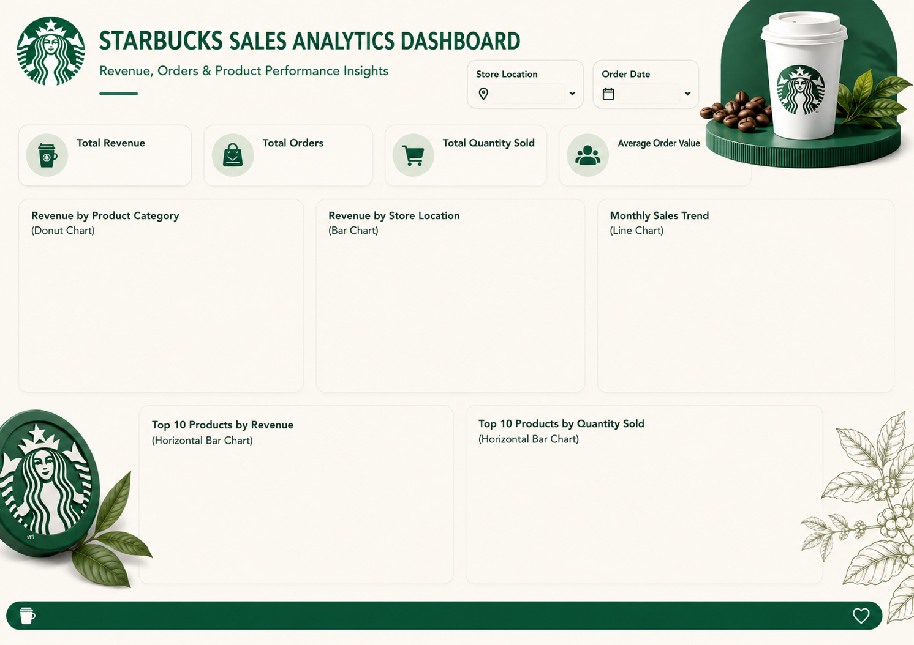

# ☕ Starbucks Sales Analytics Dashboard

## 📌 Project Overview

This project analyzes Starbucks sales data using **MySQL** and **Power BI** to uncover valuable business insights related to revenue, product performance, store performance, and sales trends. The project includes data cleaning, data validation, exploratory data analysis (EDA), and an interactive dashboard for decision-making.

---

## 🛠️ Tools & Technologies Used

* MySQL
* SQL
* Power BI
* Data Cleaning
* Data Visualization
* Business Intelligence

---

## 🧹 Data Cleaning & Validation

The following data quality checks were performed using SQL:

* Duplicate Detection & Removal
* Missing Value Validation
* Negative Value Checks
* Total Bill Verification
* Data Quality Validation

---

## 📊 Key Performance Indicators (KPIs)

* 💰 Total Revenue
* 🛒 Total Orders
* 📦 Total Quantity Sold
* 📈 Average Order Value

---

## 📈 Dashboard Visualizations

* Revenue by Product Category
* Revenue by Store Location
* Monthly Sales Trend
* Top 10 Products by Revenue
* Top 10 Products by Quantity Sold

---

## 🔍 Key Business Insights

* Identified top-performing products by revenue.
* Compared revenue across different store locations.
* Analyzed monthly sales performance trends.
* Evaluated category-wise revenue contribution.
* Identified products with the highest sales volume.

---

## 📸 Dashboard Preview



---

## 📂 Project Structure

```text
Starbucks
├── Images
│   └── dashboard.png
├── SQL
│   └── Starbucks_SQL_Queries.sql
├── Starbucks.pbix
└── README.md
```

---

## 🚀 Project Files

* Power BI Dashboard (.pbix)
* SQL Queries (.sql)
* Dashboard Screenshot (.png)

---

## 👨‍💻 Author

**Yogesh Kumar**

* LinkedIn: https://www.linkedin.com/in/yogesh-kumar-data-analyst
* GitHub: https://github.com/yogesh12334
